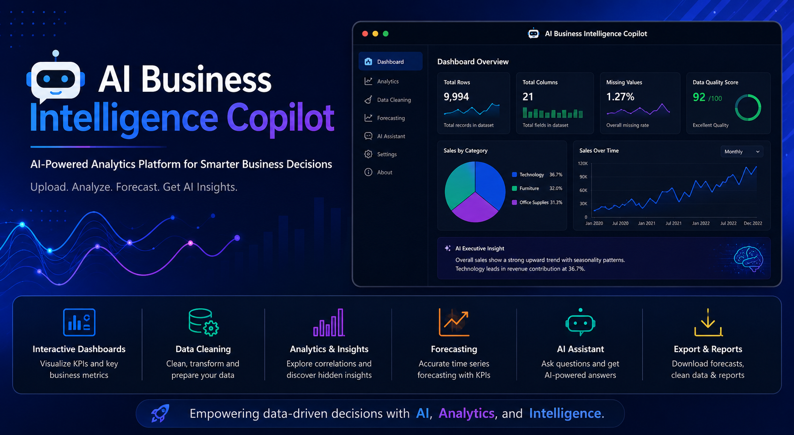
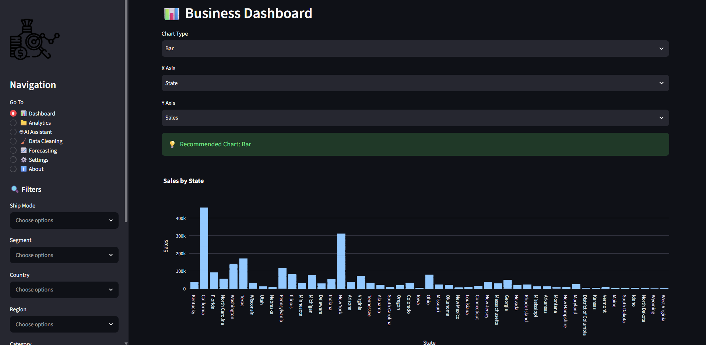
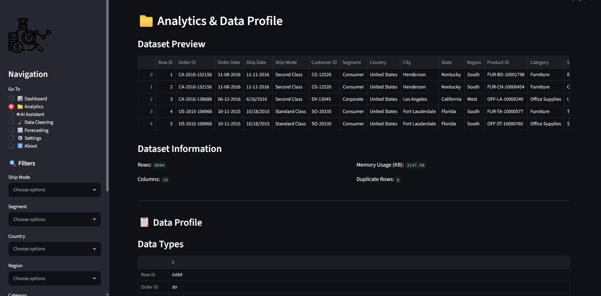
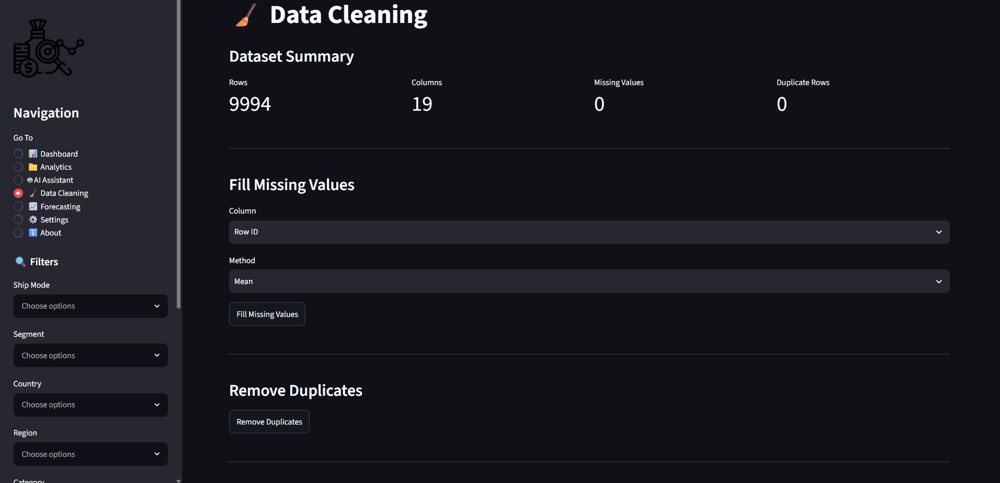
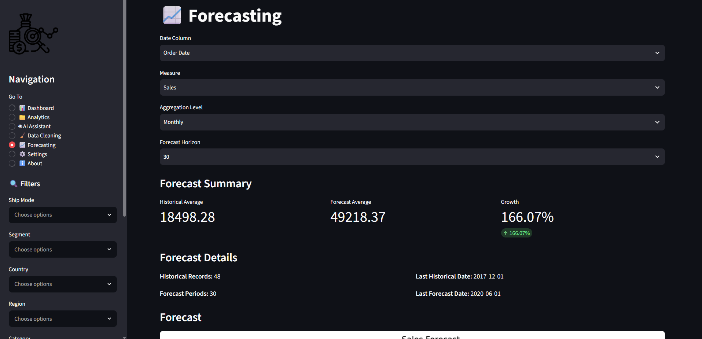
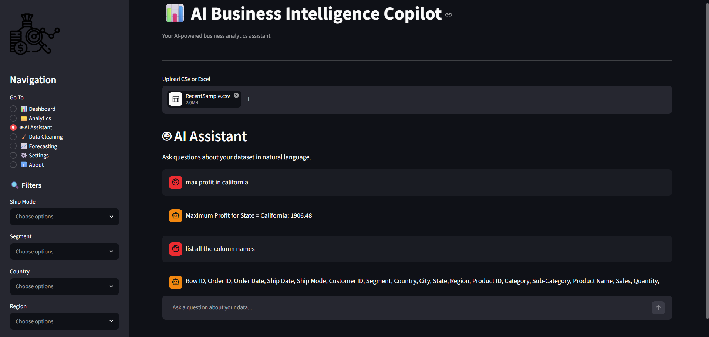
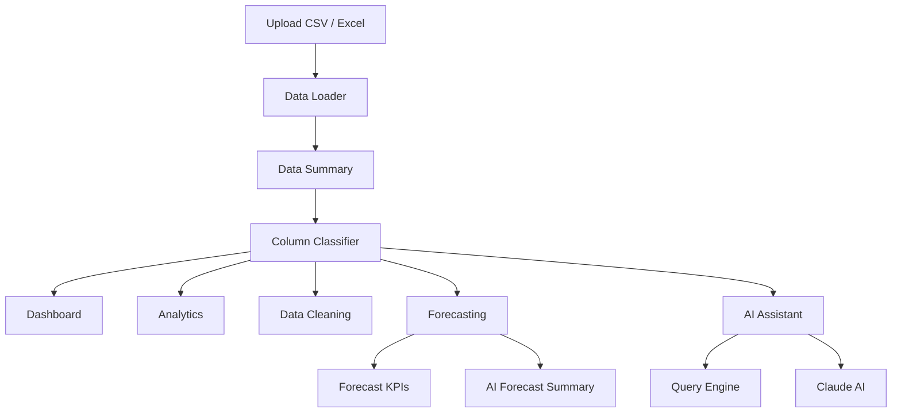

# 🤖 AI Business Intelligence Copilot




## 🚀Live Demo
👉 **Launch AI Business Intelligence Copilot**
https://ai-business-intelligence-copilot-gn2hysv7h4hasnl6mwjwta.streamlit.app 

An AI-powered Business Intelligence platform built with **Python** and **Streamlit** that enables users to upload datasets, clean and analyze data, generate interactive dashboards, forecast future trends, and receive AI-generated business insights using natural language.

---

## 🎯 Project Highlights

- 📊 Interactive Business Intelligence Dashboard
- 🧹 No-Code Data Cleaning Interface
- 📈 Automated KPI Generation
- 📉 Correlation & Data Quality Analysis
- 🔮 Time Series Forecasting (Holt-Winters)
- 🤖 AI-Powered Dataset Assistant (Claude)
- 📥 Download Cleaned Data & Forecast Results
- 🏗️ Modular Frontend/Backend Architecture
---
## 💡 Why I Built This

Business analysts and decision-makers often work with multiple tools to clean data, analyze trends, build dashboards, and generate reports. I built AI Business Intelligence Copilot to bring these capabilities into a single application, combining data preparation, interactive analytics, forecasting, and AI-powered insights in one streamlined workflow.
---

## 📸 Application Preview

### Dashboard



---

### Analytics



---

### Data Cleaning



---

### Forecasting



---

### AI Assistant



---

## 🏗️ System Architecture



---

## ✨ Features

### 📊 Business Intelligence

- Interactive dashboards
- KPI cards
- Executive insights
- Dynamic filtering
- Interactive visualizations

### 🧹 Data Cleaning

- Missing value handling
- Duplicate removal
- Rename columns
- Change data types
- Drop unwanted columns
- Download cleaned dataset

### 📈 Analytics

- Data profiling
- Correlation analysis
- Distribution analysis
- Business insights
- Data Quality Score

### 🔮 Forecasting

- Holt-Winters Exponential Smoothing
- Daily / Weekly / Monthly aggregation
- Forecast KPIs
- AI-generated forecast summary
- Download forecast results

### 🤖 AI Assistant

- Natural language dataset questions
- Executive dataset summaries
- AI-powered business insights
- Intelligent fallback to Claude AI

---

## 🛠️ Technology Stack

| Category | Technologies |
|-----------|--------------|
| Language | Python |
| Framework | Streamlit |
| Data Processing | Pandas, NumPy |
| Visualization | Plotly |
| Forecasting | Statsmodels |
| AI | Anthropic Claude API |
| File Support | CSV, Excel |

---

## 📂 Project Structure

```text
AI-Business-Intelligence-Copilot/
│
├── app.py
├── config.py
├── requirements.txt
├── README.md
│
├── assets/
├── backend/
├── frontend/
├── data/
├── docs/
├── outputs/
└── tests/
```

---

## 🚀 Installation

```bash
git clone https://github.com/keerthana-data-stack/AI-Business-Intelligence-Copilot.git

cd AI-Business-Intelligence-Copilot

pip install -r requirements.txt

streamlit run app.py
```

---

## 📌 Modules

### 📊 Dashboard

Visualize KPIs, metrics, charts, and executive summaries.

### 📈 Analytics

Explore distributions, correlations, and business insights.

### 🧹 Data Cleaning

Clean and transform datasets without writing code.

### 🔮 Forecasting

Generate business forecasts using Holt-Winters Exponential Smoothing.

### 🤖 AI Assistant

Interact with your data using natural language powered by Claude AI.

---
## 🎓 Key Learnings

This project strengthened my ability to:

- Design modular and maintainable Python applications
- Build interactive analytics dashboards with Streamlit
- Develop reusable backend components for data processing
- Apply time series forecasting using Holt-Winters Exponential Smoothing
- Integrate generative AI into business analytics workflows
- Create user-friendly data applications with robust error handling

---
## ⚡ Challenges

Some of the key challenges during development included:

- Designing a reusable frontend/backend architecture
- Handling datasets with inconsistent schemas
- Maintaining application state across pages
- Optimizing AI calls to reduce unnecessary API usage
- Building forecasting workflows that support multiple aggregation levels
---
## 🚀 Future Enhancements

- Power BI Integration
- Salesforce CRM Integration
- Automated PDF Reports
- User Authentication
- Cloud Database Support
- Scheduled Report Generation

---

## 👩‍💻 Author

**Keerthana Singaravel**

MS Business Analytics • Seattle University

---

### ⭐ If you found this project interesting, consider giving it a star!